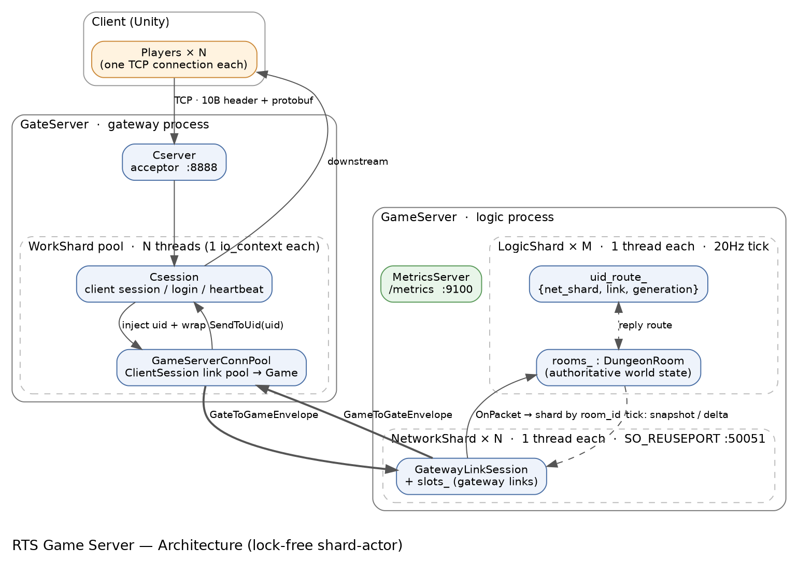

# RTS 游戏服务器后端

这是我自己写的一个 RTS(即时战略)游戏的服务器端,C++20。做它主要是想把后端里几块我一直想搞明白的东西真正落地一遍:异步网络怎么写、多核怎么吃满又不被锁拖死、服务到底能扛多少、过载了会怎么样、线上怎么观察。所以我没停在"功能能跑",而是花了挺多时间在压测、定位瓶颈和优化上,这部分的数据都记在 [PERF_REPORT.md](PERF_REPORT.md) 里。

客户端是 Unity 写的(另一个仓库),这个仓库只有服务器。

用到的东西:C++20、Boost.Asio(用的是协程那套)、Protobuf 做序列化、CMake 构建、Catch2 写单测、GitHub Actions 跑 CI。

## 整体结构



服务器拆成两个进程:

- GateServer(网关),监听 8888,面向客户端。负责收客户端连接、登录、心跳,然后把客户端的请求转发给后面的逻辑服。它内部维护到 GameServer 的一批长连接(连接池),客户端的流量都复用在这几条内部连接上。
- GameServer(逻辑),监听 50051,真正跑游戏。房间、单位、战斗、经济这些都在这。

为什么要拆两个进程:网关那层主要是 IO 密集(大量客户端连接、收发、转发),逻辑那层是 CPU 密集(跑仿真)。拆开之后两边可以各自按自己的特点扩,逻辑服也不用直接暴露给客户端。

GameServer 内部又分成两类 shard,各自独占一个线程和一个 `io_context`:

- NetworkShard:管一批网关链路(收包、发包、序列化)。用 `SO_REUSEPORT` 让多个 NetworkShard 绑同一个端口,内核负责把进来的连接分到各个 shard。
- LogicShard:按 `room_id` 分片,每个 shard 管一批房间,自己跑 20Hz 的 tick。

## 一条消息是怎么走完的

我觉得看懂这一段基本就看懂整个系统了。

客户端发一个移动指令上来,大致是这样:

```
Csession.handle_read                         （网关,客户端所在的 WorkShard 线程）
  → ClientIngressRouter::HandleMsg(msg_id)
      LoginReq 的话本地处理（HandleLoginReq，算出 uid 并 BindUid）
      其它的话 ForwardClientMsgToGame：
        GateProtocol 把客户端的裸消息包进 GateToGameEnvelope，注入 uid
        → WorkShard::PostMessage → GameServerConnPool → ClientSession::SendData 发往逻辑服

GatewayLinkSession.handle_read → NetworkShard::OnPacket   （逻辑服,某个网络 shard 线程）
  解出 GateToGameEnvelope，拿到 uid 和内层 msg_id
  ResolveLogicShard：按 room_id % shard_count 选逻辑 shard（CreateRoom 没有 room_id，就轮询挑一个）
  组一个 LogicTask，带上 origin（回包要用的路由坐标）
  → GameServer::PostToLogic(shard)，asio::post 投过去

LogicShard::handleTask                        （逻辑服,对应的逻辑 shard 线程）
  先把 uid_route_[uid] = task.origin 记下来（回包时要按这个找回客户端）
  LogicRouter::Dispatch 按 msg_id 分发到 HandleCreateRoom / HandlePlayerCommand 等
  指令在这里被解析成"意图"放进房间的 pending_ 队列，并不马上改世界
```

然后是 tick。每个 LogicShard 有一个 20Hz 的循环,到点了才统一处理:

```
LogicShard::TickLoop  （用绝对时刻调度，避免每次 expires_after 累积出漂移）
  TickRooms：遍历已开局的房间
    room.ApplyPending()   把这一帧攒下的意图一次性应用（移动目标、攻击目标等）
    room.Step(dt)         推进一帧：移动、采集、建造、追击、攻击、死亡
    每 N 帧发一次全量 SnapshotNtf，其余帧发增量 WorldDeltaNtf / EntitySpawnNtf / EntityDespawnNtf
    清掉这一帧的 dirty / spawned / despawned 记录
```

回包是反过来走:

```
LogicShard::SendToPlayers(uids, 消息)         （逻辑 shard 线程）
  按 uid_route_ 把目标 uid 分组成 {网络shard → [链路, uid 列表]}
  对每个网络 shard：GameServer::PostToNetwork(net_shard, NetworkTask)，asio::post 过去

NetworkShard::HandleNetworkTask               （网络 shard 线程）
  对每条链路：先校验 slots_[link].generation == 路由里的 generation（防止 slot 被复用后发错人）
  BuildGameToGatewayEnvelope 打包，slots_[link].session->PostSend 发回网关

ClientSession.HandleRead → BackendIngressRouter   （网关）
  ForwardGameToClients 解 GameToGateEnvelope
  WorkShard::SendToUid(uid) 找到客户端的 Csession，发回去
```

这里有个我想了挺久才理顺的点:回包的时候网络层并不靠 uid 去查表。`uid → {网络shard, 链路, generation}` 这个映射是存在逻辑 shard 里的(逻辑 shard 本来就是单线程,存这个不用加锁)。回包时逻辑 shard 直接把"坐标"算好,网络 shard 拿到坐标后用 link 在自己的 `slots_` 里取 session 就行,generation 用来挡掉"这条 slot 已经断开又被新连接复用"的情况。这样回包整条路径上没有任何共享的 uid 表,也就不用锁。

## 为什么整个服务里没有业务锁

核心就一句:有状态的东西都只属于某一个单线程的 shard,跨线程只投消息、不共享内存。

具体来说,LogicShard 的 `rooms_`、`uid_route_`,NetworkShard 的 `slots_`,都只在它自己那个线程里被读写。要跨线程(网络收到包要交给逻辑、逻辑要回包给网络),就用 `asio::post` 把一个任务投到目标 shard 的 `io_context`,由它自己的线程取出来执行。这其实就是 actor 模型,消息进信箱、单线程处理。

分片键也是配合这个设计选的。逻辑层按 room_id 分,而且房间号生成的时候我让它落在自己 shard 的同余类里(`room_id % shard_count == shard_id`),这样一个房间和它里面所有玩家一定落在同一个逻辑 shard,房间状态天生就不会被多线程碰。网络层用 SO_REUSEPORT,连接由内核分到各 acceptor,每个 NetworkShard 管自己那摊。

所以这里没有 mutex,也没有 strand。这不是"用了很高级的无锁数据结构",恰恰相反,是靠分片把"需要共享"这件事消掉了。

## 协议

包头固定 10 字节,大端:magic(2 字节,0x5254,也就是 "RT")、msg_id(2)、flags(2)、body_len(4),后面跟 protobuf 的 body。常量都在 `common/Protocol.h`,消息定义在 `proto/rts.proto`。

几种消息的封装不太一样:

- 客户端和网关之间发的是裸消息(msg_id 就是 MoveCmd 这种),uid 由网关按 session 注入,客户端自己不填。
- 网关和逻辑服之间,房间/玩法消息包在 GateToGameEnvelope 里(带 uid、room_id、内层 msg_id、payload),回包包在 GameToGateEnvelope 里(带 target_uids、内层 msg_id、payload)。GateLinkHello、PingReq 这种是裸包。
- 还有个 RoomRouteHint,只是给网络层在内层 payload 里快速取 room_id 用的,这样路由的时候不用关心具体是哪种消息。

TCP 是字节流,所以收包要先读满 10 字节头、解出 body_len、再读满 body,循环切包。这块在各个 session 的 ReadHead/ReadData 里。

## tick 和状态同步

走的是服务器权威的状态同步,不是帧同步。客户端只发"我想干什么",服务器在 tick 边界统一处理、推进世界,然后把结果(快照)发回去。选状态同步是因为我想把含金量留在服务端(权威仿真、快照、背压、以后想做的 AOI),反作弊也更好做。

tick 是固定 20Hz(50ms 一帧)。有两个细节我特意处理了:一是用绝对时刻调度(`expires_at(上次截止 + 50ms)`)而不是每次从现在加 50ms,否则误差会累积、tick 越跑越偏;二是如果某一帧落后太多,直接重新对齐而不是疯狂追帧,免得陷入越追越落后的死亡螺旋。

下发用全量加增量:每 N 帧发一次全量快照(SnapshotNtf)做基准,中间帧只发变化的部分(WorldDeltaNtf,加上实体生灭的 EntitySpawnNtf / EntityDespawnNtf)。哪些实体变了,是靠 DungeonRoom 里的 dirty 集合记的。

## 游戏逻辑(DungeonRoom)

DungeonRoom 是房间的世界状态加仿真,我特意把它写成不依赖 protobuf、不依赖网络的纯逻辑,这样能直接拿来写单测(测试不用起服务器、不用发包)。

它里面有这些东西:

- 实体:Unit、Building、ResourceFieldEntity、ResourceDropEntity,id 由服务器分配。
- 帧变更:dirty_ / spawned_ / despawned_ 三个集合。Step 里改了谁就把谁标进 dirty,tick 末打包成增量后清空。
- 命令:EnqueueCommand 入队,ApplyPending 在 tick 边界统一应用。所有权校验(你只能指挥自己的单位)就在这一步做。
- Step(dt):单位移动(方案 A,沿客户端给的 NavMesh 路径折线走,没给路径就直线奔目标)、工人的采集→返还状态机、建造进度、训练队列、追击-攻击-冷却-死亡。
- 胜负:BeginBattle 记下开局有几个阵营,CheckGameOver 在只剩一个阵营时判胜。

寻路这里要说明一下:我用的是方案 A,路径由客户端(Unity 的 NavMesh)算好,通过 MoveCmd 的 path 字段发上来,服务器只沿折线推进。也就是说服务器不跑 A*。好处是服务器很便宜,代价是路径的合法性是信客户端的(服务器只校验速度、终点这些)。如果要做服务器权威寻路,那是另一套成本,见 PERF_REPORT 里的讨论。

## 性能这块我做了什么

详细数据在 [PERF_REPORT.md](PERF_REPORT.md),这里讲过程。

我先自己写了个压测工具(tools/loadtest.cc),直连 GameServer 模拟网关链路,靠 envelope 里的 uid 用少数几条连接就能驱动上千个虚拟房间,能压移动、采集、建造、训练、战斗。压的时候发现一个现象:房间数加到 4000 的时候,tick 从 20Hz 掉到了 13Hz,但整机 CPU 才用了 1.4 个核(总共 4 核)。说明不是 CPU 不够,是某个东西先满了。

于是我做了逐线程的 CPU 采样(读 /proc/pid/task 下每个线程的 utime+stime,隔几秒采两次算出每个线程占了多少核),结果很清楚:有一个线程被钉在 100%,另外 8 个逻辑线程几乎全闲。那个满的就是网络线程——当时网络层只有一个,所有入站解包和所有出站(路由、打 envelope、序列化)都挤在它一个线程上。

定位到之后,我把网络层也改成了分片(就是现在的多个 NetworkShard + SO_REUSEPORT),没有给那个单线程加锁,而是让它变成多个各自单线程的 shard。改完跑同样的 4000 房间负载,p95 延迟从 5.3 秒降到了 21ms,吞吐翻倍,tick 回到 20Hz。我又采了一次逐线程,确认这回是 4 个网络线程均摊、没有谁被打满,瓶颈确实消除了——这一步是为了用数据证明,而不是"感觉变快了"。

压测过程中还顺带发现一个可靠性问题:过载的时候发送队列会无限堆积,内存一路涨到 1.1G。我给每条连接的发送队列加了上限,满了就丢最旧的包(状态同步下一帧的全量快照会把客户端重新对齐,所以丢增量是可恢复的)。加完之后同样的过载场景,内存压到了 108M,而且 tick 反而稳住了(因为不再被巨大的积压拖着走)。

后来为了能持续观察,我加了个 /metrics 端点(Prometheus 文本格式,独立线程跑,不抢游戏线程),把 tick 的 p50/p99、各种计数、房间/单位数、背压丢包数都暴露出来。压测时 curl 一下就能看到,比如过载时丢包计数会从 0 涨起来。

最后我还写了第二个压测工具 tools/e2e_loadtest.cc,这个是真客户端,连网关走全链路(登录→建房→准备→移动),用来补上"网关 + 逻辑服一起"的端到端测试(之前那个直连逻辑服,绕过了网关)。

## 构建和运行

```bash
# 依赖(Ubuntu)
sudo apt install -y cmake g++ libboost-system-dev libspdlog-dev \
    protobuf-compiler libprotobuf-dev catch2

cmake --preset linux-release
cmake --build --preset linux-release -j

# 要在仓库根目录跑,它会读 config/config.ini
./build/linux-release/GameServer    # 逻辑服 50051,metrics 9100
./build/linux-release/GateServer    # 网关 8888

# 单测(逻辑层是纯逻辑,所以能直接测;CI 每次提交也会跑)
ctest --test-dir build/linux-debug --output-on-failure

# 压测
./build/linux-release/loadtest     127.0.0.1 50051 8 500 10 100   # 直连逻辑服
./build/linux-release/e2e_loadtest 127.0.0.1 8888 2000 10 100 2   # 端到端经网关
curl localhost:9100/metrics
```

config/config.ini 里能调的:logic_shards、network_shards、gateway_link_count、metrics_port。

## 想加功能的话

加一个新的玩法指令,大概要动这几个地方:

1. proto/rts.proto 加消息和 MsgId,common/Protocol.h 同步枚举。
2. 网关:在 ClientIngressRouter::Init 里注册转发(RegisterForward),让网关把它包成 envelope 转给逻辑服。
3. 逻辑服:NetworkShard::OnPacket 的 switch 里把它归到玩法分支;LogicRouter::Init 注册到某个 Handle 函数;在 LogicShard::HandlePlayerCommand 里解析出来 EnqueueCommand。
4. DungeonRoom 里加对应的 Apply 和 Step 逻辑,改到的实体记得标 dirty,再在快照/增量的 Fill 函数里把新字段带上。最后补个单测。

加一个新的仿真系统(比如新的资源、新的状态),就是在 DungeonRoom::Step 里加一步,注意改了状态要进 dirty,快照里要带上。

要扩容量就改 config 里的 logic_shards / network_shards,网络 shard 走 SO_REUSEPORT,加机器也是同理。

## 目录

- common/ 协议常量和 protobuf 编解码
- proto/ rts.proto
- GateServer/ 网关(Csession、WorkShard、连接池、Router 等)
- GameServer/ 逻辑(NetworkShard、LogicShard、DungeonRoom、Metrics 等)
- tests/ Catch2 单测,覆盖 DungeonRoom 的纯逻辑
- tools/ loadtest.cc(直连压测)、e2e_loadtest.cc(端到端压测)
- docs/ 架构图
- PERF_REPORT.md 压测报告,包含方法和数据

## 踩过的坑(随手记的)

- 有次把一个访问器命名成 ShardId(),结果在类作用域里把同名的类型别名 ShardId 给遮蔽了,报错说 "ShardId does not name a type",但同一行的 MsgId 又没事,卡了一会才反应过来是名字撞了。
- 单例里写过 `make_shared<T>(new T)`,本意是用这个指针,实际是把指针当构造参数传进去了,编译不过。
- 早期单例析构里打了条日志,进程退出时静态析构阶段 spdlog 已经被销毁,结果退出时段错误。
- 收包路径里每个包都先 memset 一遍 64KB 的缓冲区,纯属浪费(async_read 会覆盖要用的字节),去掉之后小包吞吐好了一截;另外 socket 都补上了 TCP_NODELAY。

## 还想做的

服务器端权威寻路(A* 或流场)、AOI 视野裁剪、账号持久化和鉴权、容器化部署。
